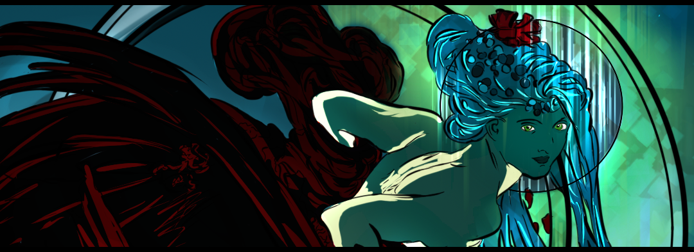

<h1 align="center">
  <br>
  <a href="https://github.com/sabattle/CalypsoBot"></a>
  <br>
  CalypsoCore *Not finished yet.
  <br>
</h1>

<h3 align=center>It was developed with <a href=https://github.com/discordjs/discord.js>discord.js</a> so that you can use the foundation of CalypsoBot for your own purposes.</h3>


<div align=center>

  <a href="https://github.com/discordjs">
    
  </a>

  <a href="https://github.com/sabattle/CalypsoBot/blob/develop/LICENSE">
    
  </a>

</div>

<p align="center">
  <a href="#installation">Installation</a>
  •
  <a href="#setting-up">Setting Up</a>
  •
  <a href="#license">License</a>
  •
  <a href="#credits">Credits</a>
</p>

## Installation

You can add Calypso to your server with [this](https://discordapp.com/oauth2/authorize?client_id=416451977380364288&scope=bot&permissions=403008599) link! Alternatively, you can clone this repo and host the bot yourself.
```
git clone https://github.com/sabattle/CalypsoBot.git
```
After cloning, run an
```
npm install
```
to snag all of the dependencies. Of course, you need [node](https://nodejs.org/en/) installed. I also strongly recommend [nodemon](https://www.npmjs.com/package/nodemon) as it makes testing *much* easier.

## Setting Up

You have to create a `config.json` file in order to run the bot (you can use the example file provided as a base). Your file should look something like this:
```
{
  "token": "your_token_here",
  "ownerId": "your_ID_here",
  "bugReportChannelId": "bug_report_channel_ID_here",
  "feedbackChannelId": "feedback_channel_ID_here",
  "serverLogId": "server_log_ID_here",
  "apiKeys": {
    "catApi": "your_API_key_here",
    "googleApi": "your_API_key_here"
  }
}
```
Visit the Discord [developer portal](https://discordapp.com/developers/applications/) to create an app and use the client token you are given for the `token` option. `ownerId` is your own Discord snowflake. `bugReportChannelId`, `feedbackChannelId`, and `serverLogId` should be set to respective text channels on your own server. To get keys for supported APIs, vist:

  * [TheCatAPI](https://thecatapi.com/)
  * [Google APIs](https://console.developers.google.com/apis/)

After your `config.json` file is built, you have enable `Privileged Intents` on your Discord [developer portal](https://discordapp.com/developers/applications/). You can find these intents under the "Bot" section, and there are two ticks you have to switch on. For more information on Gateway Intents, check out [this](https://discordjs.guide/popular-topics/intents.html#the-intents-bit-field-wrapper) link.

Once done, feel free to launch Calypso using the command `node app.js` or `nodemon app.js`. If on Linux, you can also kick off using the `start.sh` script. If you need additional help setting up, join the [Calypso Support Server](https://discord.gg/pnYVdut)!

**Important Note:** Do not use Heroku to host Calypso! Calypso uses SQLite as its database which backs up its data store on disk. Heroku clears its contents often, so your database will be wiped. Read more [here](https://devcenter.heroku.com/articles/sqlite3).

## License

Released under the [GNU GPL v3](https://www.gnu.org/licenses/gpl-3.0.en.html) license.

## Credits

* **Sebastian Battle** - *Initial work* - [github](https://github.com/sabattle)
* **Kyle Glaws** - [github](https://github.com/krglaws)
* **CommradeFido#5286** - *Calypso's art and graphics*
* **Threebow** - *Ideas and tutorials* - [github](https://github.com/Threebow)